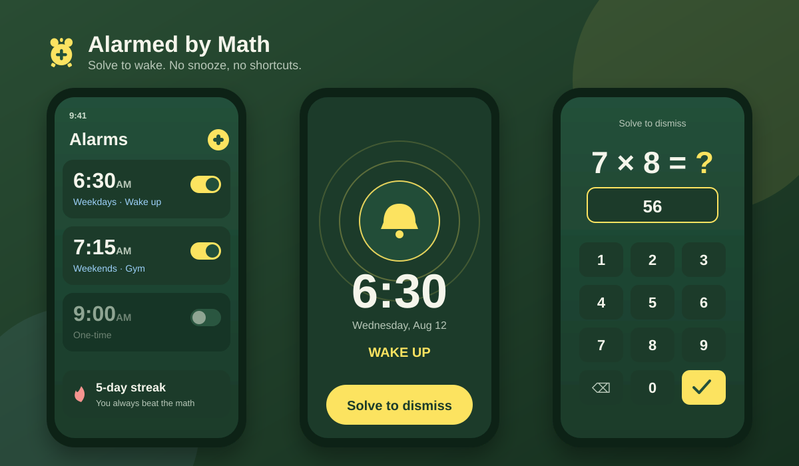

<p align="center">
  <picture>
    <source media="(prefers-color-scheme: dark)" srcset="docs/assets/logo-dark.svg">
    
  </picture>
</p>

<p align="center">
  <b>An alarm clock that gives your brain a reason to wake up.</b>
</p>

<p align="center">
  <a href="https://github.com/evillollive/alarmed-by-math/releases/latest"></a>
  
  
  
  
  <a href="LICENSE"></a>
  <a href="https://evillollive.github.io/alarmed-by-math/privacy.html"></a>
</p>

# Alarmed by Math

Alarmed by Math is a small, focused iOS alarm app built with Swift and SwiftUI.
When an alarm goes off, open the app and solve a configurable math challenge to
complete it. Choose whether audio keeps ringing while you solve or pauses with
a scheduled re-ring. System controls and iOS restrictions still apply; the app
does not provide an unbreakable math gate or guarantee that you will wake up.

<p align="center">
  
</p>

> Curious where this is headed? See the [**Roadmap**](ROADMAP.md).

## Contents

- [Quick start](#quick-start)
- [Release status](#release-status)
- [How it actually works](#how-it-actually-works)
- [Scheduling and clock changes](#scheduling-and-clock-changes)
- [Free vs Premium](#free-vs-premium)
- [The clever bits](#the-clever-bits)
- [Sound V2](#sound-v2)
- [Artwork](#artwork)
- [What's under the hood](#whats-under-the-hood)
- [Project structure](#project-structure)
- [Requirements](#requirements)
- [Local development checks](#local-development-checks)
- [Accessibility](#accessibility)
- [Privacy](#privacy)
- [Open-source app, separate Premium add-on](#open-source-app-separate-premium-add-on)
- [License](#license)

## Quick start

1. Clone the repo:
   ```bash
   git clone https://github.com/evillollive/alarmed-by-math.git
   ```
2. Open `AlarmedByMath.xcodeproj` in Xcode
3. Build and run on a simulator or device
4. Grant alarm access on iOS 26.1+, or notification access on older supported versions

That's it. No dependencies, no pods, no package manager fuss.
If access is denied or scheduling fails, the alarm list shows recovery guidance
and a retry action. A saved alarm is not a guarantee that the system scheduled it.

## Release status

**[v1.7.0](https://github.com/evillollive/alarmed-by-math/releases/tag/v1.7.0),
build 6** is a source-code release dated October 1, 2026. It includes the merged
alarm-planning and audio updates, silent math practice, alarm duplication,
Sound V2, and the refreshed clock artwork and typography.
See the [changelog](CHANGELOG.md) for changes, migrations, and known limitations.

This GitHub release contains source, not a signed app, TestFlight build, or
App Store release. Building requires **Xcode 27 with the iOS 27 SDK**; the app
still supports **iOS 17+**. Local development checks do not qualify physical
wake reliability. Locked/background ringing, Focus and volume behavior, audio
routes, native recurring DST delivery, and private Premium/signing checks
remain on the [roadmap](ROADMAP.md). Skip-next is not included.

The Release workflow publishes GitHub release notes only. There is currently
no hosted app build/test workflow, and a successful Pages deployment is not an
app test result. For future releases, update the app and widget version/build
settings together, record changes in the changelog, validate locally, and merge
through a pull request before tagging that exact commit. Hosted triggers need
a separately approved runner-minute budget; a source release does not waive
device or distribution qualification.

## How it actually works

The flow is intentionally simple so there's nothing between you and the alarm doing its job:

1. **Set an alarm.** Pick a time, give it a label if you want, choose which days it repeats.
2. **It goes off.** On iOS 26.1+, AlarmKit presents a system alarm, including on
   the Lock Screen. Older supported versions use notification sounds. Opening
   the app presents the ringing screen.
3. **Solve to dismiss.** Open the challenge and complete the configured number
   of problems. Keep-ringing mode retains audio; auto-snooze pauses it and
   schedules a re-ring after the chosen delay, which defaults to 5 minutes.
4. **Wrong answer?** Try a new problem. Completing the challenge dismisses the
   active alarm and cancels its pending re-rings.
5. **System controls still apply.** AlarmKit's Stop action attempts a bounded
   series of re-rings while the challenge is unsolved. Delivery depends on
   system permissions and scheduling; this is not an unlimited enforcement loop.
6. **One-time alarms expire cleanly.** After a one-time alarm fires, it is marked fired and disabled so it doesn't silently roll into future days.

## Scheduling and clock changes

New or explicitly re-enabled one-time alarms use the next valid occurrence of
the chosen local time. Setting 7:00 after 8:00 therefore schedules the next
morning. Each one-time alarm stores its intended local calendar day, so reopening
the app after that occurrence cannot silently turn it into another day's alarm.
Completed and expired alarms remain off until explicitly re-enabled.

The shared planning rules skip nonexistent spring-forward times and choose only
the first copy of a repeated fall-back time. One-time alarms are submitted as
exact dates, including their intended day and first fall-back instant. Repeating
alarms remain system-managed weekly local-time schedules: AlarmKit and repeating
notification triggers do not expose explicit DST-policy switches. The app and
widget agree on planned dates, but native recurring delivery at DST boundaries
still requires real-device qualification before distribution.

**After travel or a manual clock change, open the app before relying on a
one-time alarm.** Its submitted date is fixed until the app recalculates it in the
phone's local time zone. If the planned local day/time is already past at the
destination, it expires rather than moving to another day. While the app is
active, significant clock, time-zone, and day-change notifications refresh its
schedules. Refreshing does not cancel an active alarm's snooze or queued alarms.

The widget retains minimal schedule definitions instead of only a short buffer
of dates, so repeating forecasts advance without reopening the app. A one-time
entry retains the last fixed planned date until the app refreshes it. Existing
undated one-time records migrate using the legacy today-only interpretation;
the upgrade does not guess a new future day for a missed alarm.

## Free vs Premium

This repository is the **complete free app**: it builds and runs on its own with the full alarm flow. Premium is an optional one-time StoreKit 2 unlock whose code lives in a separate private companion repo.

| | Free | Premium |
|---|:---:|:---:|
| Solve-to-dismiss alarm flow | ✅ | ✅ |
| Difficulty: Easy → Expert | ✅ | ✅ |
| Repeating & one-time schedules | ✅ | ✅ |
| Themes & accessibility support | ✅ | ✅ |
| Live themed clock in the widget | ✅ | ✅ |
| **Whiz** difficulty | No | ✅ |
| Solve soundtrack from your library | No | ✅ |
| Widget alarms + solve streak | No | ✅ |
| Widget customization (digital/analog, size, date) | No | ✅ |

Locked Premium features present a functional, redacted preview that deep-links to a single paywall, and any locked Premium alarm is safely normalized back to Expert until the entitlement is active.

## The clever bits

A few design choices that make this more than just "alarm + quiz":

- **Silent math practice.** Open **Practice math** at the bottom of the alarm
  list, choose a difficulty and 1-10 problems, and try the same keypad and answer
  rules used by real alarms. Practice stays in memory: it creates no alarms,
  plays no alarm audio, and does not change solve statistics or streaks. Use
  **Done** or Back to leave at any time. Correct answers and retries advance
  only when you choose to continue; Whiz remains gated by the existing Premium
  entitlement and add-on.
  The whole Practice row is tappable, including the open space on wider iPad
  layouts.
- **Copy without surprises.** Swipe right on an alarm, or use its context menu
  or VoiceOver action, to duplicate it. Review the new alarm before saving;
  cancelling the draft leaves the original and its schedule untouched.
- **Your clock preferences.** Alarm times use the device's 12/24-hour format.
  Repeat-day labels and the weekday picker follow the current calendar's
  language and first day of the week. Widgets already use native time formatting.
- **One clock-and-math identity.** Small right-triangle bells and a triangle
  inside the clock face connect the installed icon, in-app artwork, and README
  branding. The analog widget uses the same bells with time-correct hands.
  Default, dark, and tinted icon appearances share the same geometry.
- **A quieter type system.** App-owned text uses one font design per theme and
  three Dynamic Type sizes: body text, compact headings, and large time/math
  values. Labels use weight and color instead of extra fonts or tiny captions.
  Choice grids adapt to larger text; native controls and customizable widget
  sizes retain their existing behavior.
- **A curated sound collection.** Eight wake sounds cover melodic and insistent
  styles, with separate preview and selection controls. Previewing never changes
  the saved sound; explicitly selecting one updates enabled alarm schedules.
- **Free difficulty ladder, plus a real Premium tier.** Easy through Expert are available in the free app. Premium is a one-time StoreKit 2 unlock, and any locked Premium alarm is safely normalized back to Expert until the entitlement is active. A dedicated paywall is the single upsell surface, and locked features (Whiz difficulty, the solve soundtrack, the widget) deep-link straight into it.
- **Premium solve soundtrack.** Premium users can pick a song from their library to play while they solve the alarm's math. It plays in the foreground only: your phone still wakes you with the dependable bundled alarm sound, because iOS won't start library playback from the lock screen.
- **Premium Home Screen widget with a live, themed clock.** A small or medium widget shows a live current-time clock that mirrors your chosen in-app theme (colors and font), plus your next alarm and solve streak. Premium users can customize it from Settings: a **digital or analog** clock, **small/medium/large** text, an optional **date** line (weekday, short, or full), how many **upcoming alarms** the medium widget lists (1–3), and whether to **show the streak**. The clock shows for everyone; the alarm and streak details are Premium, and the locked state is a functional, redacted preview that taps through to the paywall. The app shares a derived snapshot of its palette, layout configuration, and minimal schedule definitions through an App Group. Repeating forecasts advance from those definitions; one-time entries retain their last fixed planned date until an app refresh.
- **Repeating schedules.** Set alarms for specific days of the week or leave
  them as one-time events. AlarmKit handles iOS 26.1+; older supported versions
  use local notifications with more limited silent-mode and Focus behavior.
- **Safer one-time behavior.** One-time alarms are treated as one-shot events and won't auto-reschedule for tomorrow after they have fired.
- **Configurable re-ring delay.** Auto-snooze schedules a follow-up when you
  open the challenge, using the alarm's chosen delay rather than a fixed timer
  triggered by closing the app.
- **Configurable challenge ring policy.** You can keep audio ringing while solving, or use auto-snooze and re-ring behavior.
- **Full-screen ringing.** When the alarm fires, the whole screen takes over with a pulsing animation and the current time. It's meant to be unmissable.

## Sound V2

| Style | Sounds |
|---|---|
| Melodic | Chime, Daybreak, Glasshouse, Clockwork |
| Insistent | Bell, Buzz, Roll Call, Ratchet |

Glasshouse uses the approved low-opening-note version without echoes. Ratchet
uses distinct mechanical wake-up strikes rather than the discarded saturated
bass experiment. Chime's original recording and default selection are unchanged.

On first launch after updating, saved Classic selections migrate to Roll Call.
Bell and Buzz keep their settings identifiers but use the approved V2 recordings.
The selected sound applies to every alarm. Previews use media volume, can play
on silent, and stop when dismissed, backgrounded, or interrupted by an alarm.
Scheduled alarms follow their platform's audio controls instead.

Audio-session changes and player preparation run on a serial background queue.
iOS 27 uses the native asynchronous activation/deactivation APIs; earlier
supported versions use the older API off the UI thread. Stopped or superseded
requests cannot start playback from a late callback. A solve soundtrack replaces
foreground wake audio only after it starts successfully, while auto-snooze keeps
its separate policy. Playback failures are surfaced instead of reported as success.

Each new CAF contains three identical copies of the approved eight-second phrase,
for 24 seconds of audio under the notification sound limit. This avoids a long
quiet interval in the older notification-based scheduling path. The seven new
recordings are mono, 44.1 kHz, 16-bit PCM with a -9 dBFS sample-peak ceiling;
that is not a matched-loudness or wake-effectiveness claim. Legacy recordings
remain bundled for previously registered system schedules, but are not choices
in the V2 picker.

The original synthesis is reproducible with
`python3 scripts/generate_alarm_sounds.py` on macOS. The generator checks each
phrase against its approved PCM SHA-256 and verifies lossless CAF conversion.
The generated files are included in the app target, so normal builds need no audio tools.
Actual phone-speaker, locked-screen, and scheduled-alarm checks remain necessary
before distribution. Music-library solve soundtracks remain a separate Premium feature.

## Artwork

The selected B3 design keeps the bells at 65% and face triangle at 80% of the
original concept. Its geometry is shared by the app, analog widget, and export
tool in [`AlarmClockArtwork.swift`](AlarmedByMath/Services/AlarmClockArtwork.swift).
The [SVG mark](docs/assets/chalkboard-mark.svg) and light/dark README logos are
generated from those same paths.

The native asset catalog contains opaque, full-bleed 1024px RGB PNGs for default,
dark, and tinted appearances. Corners are masked by iOS, not baked into the PNGs.
These are deliberately flat assets, not an Icon Composer layered package.

To regenerate, compile `scripts/generate_app_icons.swift` together with the shared
artwork file using `swiftc` on macOS, then run the executable with the repository
root as its argument. It updates the three icons, SVG mark, README logos, and
the branding symbol in the illustrative README demo. Final App Store screenshots
remain separate release work.

## What's under the hood

| Technology | Used for |
|---|---|
| **Swift** + **SwiftUI** | The entire UI |
| **WidgetKit** + **App Group** | Premium Home Screen widget, sharing a derived snapshot |
| **StoreKit 2** | Premium purchase, restore, and entitlement refresh |
| **AlarmKit** + **App Intents** | System alarms and solve/re-ring actions on iOS 26.1+ |
| **UserNotifications** | Notification fallback on iOS 17 through iOS 26.0 |
| **AVFoundation** | In-app alarm audio and the Premium solve soundtrack |
| **UserDefaults** (Codable) | Persistence |

Zero external dependencies: no pods, no packages.

## Project structure

```
AlarmedByMath/
├── AlarmedByMathApp.swift       # App entry point, lifecycle handling
├── Theme.swift                  # Theme palettes and color lookups
├── Models/
│   ├── Alarm.swift              # Alarm data model with validation
│   └── MathProblem.swift        # Random math problem generator
├── Services/
│   ├── AlarmStore.swift         # CRUD + persistence for alarms
│   ├── AlarmSchedule.swift      # Shared local-day, DST, and next-occurrence planning
│   ├── AlarmScheduler.swift     # Notification scheduling, audio, ringing state
│   ├── AudioSessionController.swift # Serialized session changes and player preparation
│   ├── AlarmGate.swift          # Solve-to-dismiss gate state
│   ├── AlarmKitScheduler.swift  # AlarmKit locked-screen alarms (iOS 26.1+)
│   ├── SettingsStore.swift      # Preferences and app settings
│   ├── PremiumPlugin.swift      # Runtime seam for the optional paid add-on
│   ├── WidgetSharedStore.swift  # App Group snapshot shared with the widget
│   ├── WidgetSync.swift         # Derives the snapshot and reloads timelines
│   └── StatsStore.swift         # Usage stats and milestone tracking
├── Views/
│   ├── ContentView.swift        # Main alarm list with edit/delete/toggle
│   ├── AddAlarmView.swift       # Create & edit alarm form
│   ├── AlarmRingingView.swift   # Full-screen ringing UI
│   ├── MathChallengeView.swift  # Math problem + custom number pad
│   ├── MathPracticeView.swift   # Silent, non-persistent challenge practice
│   ├── SettingsView.swift       # Themes, sound, test alarm
│   ├── PaywallView.swift        # Premium upsell sheet + compliance links
│   └── StatsView.swift          # Usage stats + hidden easter egg
├── Premium/                     # Synced folder for the private add-on (empty here)
├── AlarmedByMath.entitlements   # App Group entitlement
├── PrivacyInfo.xcprivacy        # App Store privacy manifest
└── Assets.xcassets/

AlarmedByMathWidget/             # Premium Home Screen widget extension
├── AlarmedByMathWidgetBundle.swift
├── AlarmedByMathWidget.swift    # Timeline provider, themed live clock, digital/analog layouts
├── AlarmedByMathWidget.entitlements
└── Info.plist
```

## Requirements

- iOS 17+
- Xcode 27 or later with the iOS 27 SDK, for the native asynchronous audio-session
  APIs. The deployment minimum remains iOS 17; real-device qualification stays
  on the [roadmap](ROADMAP.md).
- At runtime, iOS 26.1+ uses AlarmKit. iOS 17 through iOS 26.0 uses chained
  notifications, which do not have the same silent-mode and Focus behavior.

## Local development checks

Run the `AlarmedByMath` scheme's unit tests on an installed simulator. The shared
`AlarmedByMathUI` scheme separately checks copy-alarm review/cancellation,
sound preview/selection, silent practice, and the ringing-to-challenge flow,
attaching native screenshots to the result bundle.
It also covers rotated settings, sound selection, statistics, the Premium sheet,
and practice. iPad layout checks include portrait, landscape, and the largest
accessibility text size on the iPad mini simulator; phone portrait behavior is
preserved.
Use a dedicated simulator for UI tests because they create and delete sample
alarms and play Test Alarm audio.

Test Alarm is a foreground preview: solving it does not schedule a real re-ring
or contribute to alarm-completion statistics. Simulator checks do not qualify
locked-screen audio, Focus behavior, or physical-device wake reliability.

Silent practice uses a pushed navigation screen, not an additional modal, so
the app's existing full-screen alarm presentation remains above it. The practice
model has no access to the scheduler, audio, or statistics stores.

## Accessibility

Alarmed by Math is built to be usable for everyone, not just people who can see the screen clearly at 6 AM:

- **VoiceOver labels** on custom controls, including theme rows and the new Premium purchase and restore actions
- **VoiceOver labels on day toggles and number pad controls** so alarm setup and math input stay clear
- **Announcements** for correct and incorrect answers so you don't have to squint at feedback
- **Reduce Motion support** for ringing and challenge animations, because pulsing and shake effects aren't for everybody
- **Dynamic Type** with minimum scale factors so text stays readable at any size
- **Contrast-aware settings cards** and full-row tap targets so the Premium purchase flow stays understandable under low vision and shaky-morning conditions
- **Backend-specific setup guidance** distinguishes AlarmKit access from notification
  access and disabled notification sounds. Scheduling failures are visible with
  a retry action, rather than appearing only in logs.
- **Scrollable ringing and challenge screens** keep controls reachable when text
  grows or the available height is small. Repeated submissions are ignored while
  an answer is being processed.

## Privacy

Alarmed by Math collects nothing. There are no accounts, no servers, no analytics, and
no app-operated data backend. Alarm, setting, and statistics data lives locally in `UserDefaults`.
The optional Premium solve soundtrack reads your music library only to let you pick and
play a song, and the widget reads a small derived snapshot the app writes to a shared
App Group; neither leaves your device. The bundled
[`PrivacyInfo.xcprivacy`](AlarmedByMath/PrivacyInfo.xcprivacy) manifest
declares no tracking, no collected data, and the required-reason `UserDefaults` API
usage, and `ITSAppUsesNonExemptEncryption` is set so uploads skip the export-compliance
prompt. The hosted [Privacy Policy](https://evillollive.github.io/alarmed-by-math/privacy.html)
says the same in plain language.

## Open-source app, separate Premium add-on

This repository is the complete free app. It builds and runs on its own with Easy through Expert and the full alarm flow.

Premium code lives in a separate private companion repo. The public app includes runtime hooks so premium functionality can be added in private builds, while public builds keep free-safe behavior.

Operational and commercial premium details are intentionally documented only in the private premium repository.

## License

AGPL-3.0 © Alex Perrault. See [LICENSE](LICENSE) for details.
